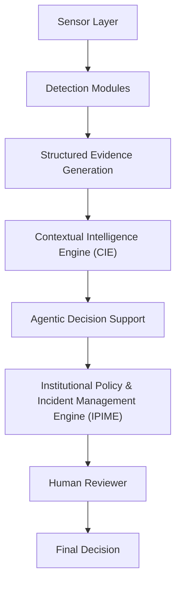
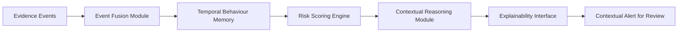
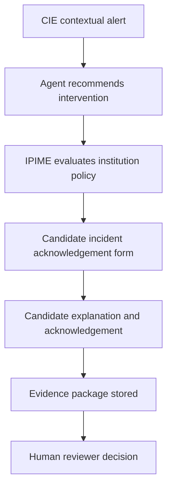

# Chapter Three Revision Guidance for SERPS

Purpose: guide the dissertation editor so Chapter Three accurately reflects the implemented SERPS prototype and the approved architectural refinements made after the original outline.

## Authoritative Sources

Chapter Three should align with:

1. `System Specification.pdf` in the project root.
2. Approved implementation addenda.
3. `docs/system_architecture.md`.
4. `docs/implementation_addendum.md`.
5. `docs/technical_readiness_report.md`.

The architecture is now frozen. Any dissertation revision should describe the implemented architecture rather than introduce a new design.

## Platform Identity

Use the formal platform identity:

**SERPS - Secure Explainable Remote Proctoring System**

The dashboard/console name remains:

**Secure Remote-Proctored Assessment Console**

The dissertation should explain that SERPS is the platform identity, while the console is the operational dashboard used for enrolment, monitoring, review, and reporting.

## Frozen SERPS Architecture

Chapter Three should present the current reference pipeline:

```text
Sensor Layer
-> Detection Modules
-> Structured Event Generation
-> Contextual Intelligence Engine (CIE)
   -> Event Fusion Module
   -> Temporal Behaviour Memory
   -> Risk Scoring Engine
   -> Contextual Reasoning Module
   -> Explainability Interface
-> Agentic Decision Support
-> Institutional Policy & Incident Management Engine (IPIME)
-> Human Reviewer
-> Final Decision
```

This should be described as an architectural refinement of the original event-fusion design, not a replacement of the system specification.

## Layer Descriptions for Chapter Three

### Sensor Layer

Describe the sensor layer as the source of raw monitoring inputs:

- primary webcam;
- secondary/environment camera;
- microphone/audio source;
- device/environment checks;
- candidate identity/authentication inputs;
- exam-player/session activity;
- manual/demo inputs used for viva validation.

The sensor layer does not classify misconduct. It only supplies observable signals to detection modules.

### Detection Layer

Detection modules convert sensor observations into structured evidence. They include:

- visual intelligence;
- object detection;
- audio intelligence;
- identity assurance;
- behavioural analytics;
- camera/device health monitoring.

Detection modules must not make final misconduct decisions or bypass the CIE.

### Structured Event Generation Layer

The structured event layer standardises detector outputs as immutable `EvidenceEvent` records containing:

- event ID;
- session ID;
- candidate ID;
- timestamp;
- source module;
- event type;
- risk weight;
- confidence;
- camera ID where applicable;
- evidence path where applicable;
- description.

This layer allows camera, audio, identity, object, behavioural, and system-health evidence to be processed consistently.

### Contextual Intelligence Engine

The Contextual Intelligence Engine (CIE) is the central reasoning layer. It should be presented as the core research contribution, replacing the earlier idea of a standalone Event Fusion Engine with a broader reasoning architecture.

The CIE does not decide misconduct. It produces contextual, explainable risk assessments for human review.

### Event Fusion Module

The Event Fusion Module is now a CIE subcomponent. It correlates multimodal evidence within configurable temporal windows and suppresses duplicate or isolated signals where appropriate.

Example correlation:

- background speech;
- repeated looking away;
- mobile phone evidence;
- identity already authenticated.

These may produce a contextual alert, but not a final disciplinary decision.

### Temporal Behaviour Memory

Temporal Behaviour Memory distinguishes isolated events from repeated patterns. Chapter Three should explain that SERPS considers persistence and temporal proximity rather than treating every event as equally significant.

### Risk Scoring Engine

The Risk Scoring Engine computes confidence-based risk scores from correlated evidence. It supports:

- current risk score;
- rolling risk score;
- risk trend;
- risk category: Low, Medium, High, Critical.

Risk scores are recommendations for review, not final decisions.

### Contextual Reasoning Module

This module interprets evidence patterns in context. It explains whether an event is isolated, repeated, multimodal, or supported by independent sources.

### Explainability Interface

The Explainability Interface prepares reviewer-facing explanations showing:

- contributing events;
- contributing modules;
- confidence;
- risk score;
- temporal window;
- reasoning trace;
- suggested reviewer action.

It must avoid language that presumes guilt.

### Agentic Decision Support

Agentic Decision Support receives CIE output and recommends operational actions such as:

- observe;
- warn candidate;
- continue monitoring;
- escalate;
- recommend human review;
- recommend suspension or termination only as a recommendation.

The agent does not make the final decision.

### Institutional Policy & Incident Management Engine

The Institutional Policy & Incident Management Engine (IPIME) should be introduced as a governance extension after Agentic Decision Support.

Its role is to translate CIE/agent recommendations into institution-specific procedures. It should be described as policy-as-code, meaning institutional rules are configurable rather than hardcoded.

Example policy mappings:

- WAEC High Risk: pause assessment, display candidate incident acknowledgement form, capture explanation, notify reviewer.
- University Medium Risk: display warning, continue assessment, flag for later review.
- Another institution Critical Risk: recommend suspension, notify senior proctor, preserve evidence.

IPIME does not make disciplinary decisions. It coordinates procedure and evidence handling under institutional rules.

### Human Reviewer Boundary

Chapter Three must clearly state:

- AI modules flag and explain.
- CIE reasons contextually.
- Agentic AI recommends actions.
- IPIME applies institutional workflow.
- Human reviewers make the final decision.

The system must never be described as an automatic cheating detector or autonomous disciplinary system.

## API-First Architecture

Chapter Three should describe SERPS as API-first and service-ready:

- Streamlit is the dashboard/control surface.
- FastAPI provides structured event service boundaries.
- Detection services can submit events through APIs.
- Future secure exam players, browser clients, edge devices, and background AI workers can integrate without bypassing CIE.

Current FastAPI boundary:

- generic structured event ingestion;
- vision frame analysis;
- audio feature-window analysis;
- identity confidence analysis.

## Streamlit Dashboard Role

Streamlit should be described as:

- operations dashboard;
- enrolment interface;
- monitoring console;
- review interface;
- report preview/export surface;
- viva/demo control surface.

It should not be described as the production monitoring engine.

## Dual-Camera Architecture

Chapter Three should retain the three monitoring modes:

- Mode A: single-camera CBT mode;
- Mode B: dual-camera full remote-proctoring mode;
- Mode C: mirror-assisted low-resource mode.

Mode B remains the strongest monitoring configuration. Mode A and Mode C support institutional and low-resource deployment realities.

## Multimodal AI

SERPS should be described as multimodal because it combines:

- primary camera evidence;
- secondary/environment camera evidence;
- audio evidence;
- identity evidence;
- behavioural evidence;
- device/session health evidence.

The value of SERPS comes from contextual correlation, not isolated detector output.

## Explainability and Human Governance

Explainability should be treated as a system requirement, not an optional feature. Every contextual alert should be reviewable through:

- evidence trail;
- explanation;
- confidence;
- risk score;
- recommendation;
- reviewer decision.

The human-in-the-loop principle should be repeated in methodology, architecture, and evaluation sections.

## Privacy-by-Design

Chapter Three should include privacy-by-design measures:

- consent and privacy acknowledgement;
- camera does not activate on page load;
- candidate acknowledgement workflow for incidents;
- structured audit trail;
- immutable raw evidence;
- data minimisation;
- local-first prototype storage;
- role-aware access;
- human-supervised decisions.

Mention that production deployment would require stronger authentication, encryption, retention enforcement, and institutional governance controls.

## Edge AI Readiness

SERPS should be described as edge-ready rather than fully edge-deployed. The prototype supports a future path where AI inference can run in:

- local OpenCV services;
- FastAPI workers;
- browser/WebRTC clients;
- edge devices;
- secure exam-player integrations.

## Live AI vs Demonstration Mode

Chapter Three should distinguish two operational modes:

1. **Live AI mode**: user-triggered or service-driven AI detectors generate evidence from supplied frames/features.
2. **Demonstration/Simulation mode**: manual evidence controls support reliable viva validation when continuous streams are unavailable.

Both modes feed the same structured event schema and CIE pipeline.

## Technical Readiness Report Integration

The Technical Readiness Report should be cited internally as the current implementation checkpoint. Chapter Three should not claim full production readiness. It should describe the system as a mature research prototype with selected live AI integrations and clearly documented limitations.

## Recommended Chapter Three Diagrams

Include the following updated diagrams:

1. SERPS layered architecture diagram.
2. CIE internal architecture diagram.
3. Decision pipeline with IPIME.
4. Dual-camera monitoring mode diagram.
5. Structured evidence event flow.
6. FastAPI/service boundary diagram.
7. Candidate incident acknowledgement workflow.
8. Human review and final decision boundary.

## Suggested Diagram: Updated Decision Pipeline



## Suggested Diagram: CIE Internal Components



## Suggested Diagram: Candidate Incident Acknowledgement



## Wording Rules for Dissertation Consistency

Use:

- "potential examination integrity concern";
- "contextual risk assessment";
- "reviewer recommendation";
- "human-supervised review";
- "evidence event";
- "candidate acknowledgement";
- "institutional policy workflow".

Avoid:

- "the candidate cheated";
- "automatic malpractice decision";
- "AI punishment";
- "autonomous disciplinary system";
- "raw-video cheating classifier".

## Current Prototype Limitation Statements

Chapter Three, Chapter Four, or Chapter Five should state:

- Continuous browser-camera AI monitoring is limited in Streamlit.
- Production-grade camera/audio streaming should use WebRTC, FastAPI/OpenCV workers, or a dedicated frontend.
- YOLO and MediaPipe are optional/live-strengthened integrations depending on local environment.
- SQLite is suitable for the prototype but not final enterprise deployment.
- The dashboard uses a prototype role simulator, not enterprise identity management.
- Final examination decisions remain with authorised human officials.

